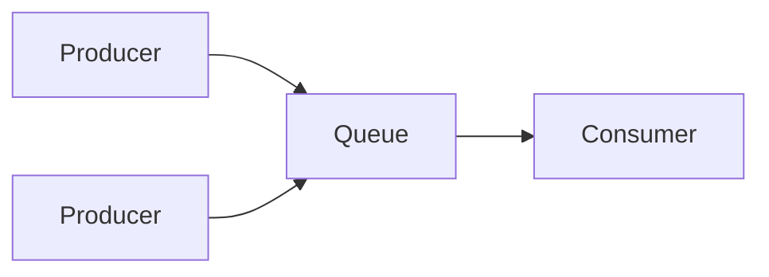
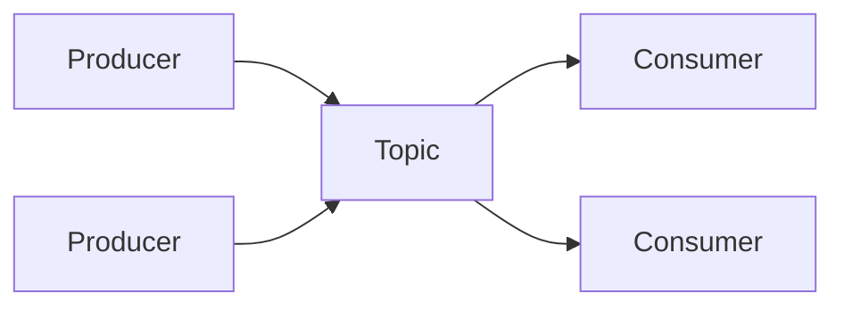

# JMS

## JMS简介

### 什么是JMS

JMS(Java Message Service)是Java平台上有关面向消息中间件的技术规范，它便于消息系统中的Java应用程序进行消息交换，并且通过提供标准的生产、发送、接受消息的接口简化企业应用的开发。

JMS本身只定义了一系列的接口规范，是一种与厂商无关的API，用来访问消息收发系统。它类似于JDBC(Java Database Connectivity)；这里，JDBC是可以用来访问许多不同关系数据库的API，而JMS则提供同样与厂商无关的访问方法，以访问消息收发服务。JMS是您能够通过消息收发服务（有时称为消息中介程序或者路由器）从一个JMS客户机向另一个JMS客户机发送消息。消息是JMS中的一种类型对象，由两部分组成：报头和消息主体。报头由路由信息以及有关消息的元数据组成。消息主体则携带着应用程序的数据或有效负载。

简单的理解：两个应用程序之间需要进行通信，我们使用一个JMS服务，进行中间的转发，通过JMS 的使用，我们可以解除两个程序之间的耦合。

解决系统之间的异步调用问题、提升系统性能。

在消息体中，JMS API定义了五种类型的消息格式，让我们可以以不同的形式发送和接受消息，并提供了对已有消息格式的兼容。不同的消息类型如下：

- **TextMessage** :        javax.jms.TextMessage，表示一个文本对象。
- **ObjectMessage** :   javax.jms.ObjectMessage，表示一个JAVA对象。
- **BytesMessage** :     javax.jms.BytesMessage，表示字节数据。
- **StreamMessage** :  javax.jms.StreamMessage，表示java原始值数据流。
- **MapMessage** :       javax.jms.MapMessage，表示键值对

### JMS消息传递类型

对于消息的传递有两种类型：

#### 点对点

一个生产者和一个消费者一一对应；

即使有多个消费者从队列里面获取消息，也只有一个消费者可以获取到这个唯一的消息。



生产者后台代码

```java
    //1.创建连接工厂
    ConnectionFactory connectionFactory = new ActiveMQConnectionFactory("tcp://127.0.0.1:61616");
    //2.创建连接
    Connection connection = connectionFactory.createConnection();
    //3.打开连接
    connection.start();
    //4.创建session  参数：1.是否开启事务；2.消息的确认方式
    Session session = connection.createSession(false, Session.AUTO_ACKNOWLEDGE);
    //5.创建队列
    Queue queue = session.createQueue("queue_001");
    //6.创建生产者
    MessageProducer producer = session.createProducer(queue);
    //7.创建消息
    TextMessage textMessage = session.createTextMessage("这是一条点对点模式的测试文本");
    //8.传递消息
    producer.send(textMessage);
    //9.关闭资源
    connection.close();
```

消费者后台代码

```java
    //1.创建连接工厂
    ConnectionFactory connectionFactory = new ActiveMQConnectionFactory("tcp://127.0.0.1:61616");
    //2.创建连接
    Connection connection = connectionFactory.createConnection();
    //3.打开连接
    connection.start();
    //4.创建session  参数：1.是否开启事务；2.消息的确认方式
    Session session = connection.createSession(false, Session.AUTO_ACKNOWLEDGE);
    //5.创建队列
    Queue queue = session.createQueue("queue_001");
    //6.创建消费者
    MessageConsumer consumer = session.createConsumer(queue);
    //7.监听消息
    consumer.setMessageListener(new MessageListener() {
        @Override
        public void onMessage(Message message) {
            TextMessage textMessage = (TextMessage)message;
            try {
                System.out.println("接收的消息为："+textMessage.getText());
            } catch (JMSException e) {
                e.printStackTrace();
            }
        }
    });
    //8.等待键盘输入(防止效果丢失)
    System.in.read();
    //9.关闭资源
    connection.close();
```

生产者连续发布两次消息后，同时在线的两个消费者并不能获取全量的消息


#### 发布/订阅

一个生产者产生消息并进行发送后，可以由多个消费者进行接受。

`如果发布消息时，消费者没有在线，将获取不到这个消息。`



生产者后台代码

```java
    //1.创建连接工厂
    ConnectionFactory connectionFactory = new ActiveMQConnectionFactory("tcp://127.0.0.1:61616");
    //2.创建连接
    Connection connection = connectionFactory.createConnection();
    //3.打开连接
    connection.start();
    //4.创建session  参数：1.是否开启事务；2.消息的确认方式
    Session session = connection.createSession(false, Session.AUTO_ACKNOWLEDGE);
    //5.创建主题
    Topic topic = session.createTopic("topic_001");
    //6.创建生产者
    MessageProducer producer = session.createProducer(topic);
    //7.创建消息
    TextMessage textMessage = session.createTextMessage("这是一条发布/订阅模式的测试文本");
    //8.传递消息
    producer.send(textMessage);
    //9.关闭资源
    connection.close();
```

消费者后台代码

```java
    //1.创建连接工厂
    ConnectionFactory connectionFactory = new ActiveMQConnectionFactory("tcp://127.0.0.1:61616");
    //2.创建连接
    Connection connection = connectionFactory.createConnection();
    //3.打开连接
    connection.start();
    //4.创建session  参数：1.是否开启事务；2.消息的确认方式
    Session session = connection.createSession(false, Session.AUTO_ACKNOWLEDGE);
    //5.创建主题
    Topic topic = session.createTopic("topic_001");
    //6.创建消费者
    MessageConsumer consumer = session.createConsumer(topic);
    //7.监听消息
    consumer.setMessageListener(new MessageListener() {
        @Override
        public void onMessage(Message message) {
            TextMessage textMessage = (TextMessage)message;
            try {
                System.out.println("接收的消息为："+textMessage.getText());
            } catch (JMSException e) {
                e.printStackTrace();
            }
        }
    });
    //8.等待键盘输入(防止效果丢失)
    System.in.read();
    //9.关闭资源
    connection.close();
```


生产者发布两次消息后，在线的两个消费者都获得的全量的消息


### 一些概念（广义）

- JMS提供者

连接面向消息中间件的，JMS接口的一个实现。提供者可以是Java平台的JMS实现，也可以是非Java平台的面向消息中间件的适配器。

- JMS客户

生产或消费基于消息的Java的应用程序或对象。

- JMS生产者

创建并发送消息的JMS客户。

- JMS消费者

接收消息的JMS客户。

- JMS消息

包括可以在JMS客户之间传递的数据的对象

- JMS队列

一个容纳那些被发送的等待阅读的消息的区域。与队列名字所暗示的意思不同，消息的接受顺序并不一定要与消息的发送顺序相同。一旦一个消息被阅读，该消息将被从队列中移走。

- JMS主题

一种支持发送消息给多个订阅者的机制。

### JMS对象要素

- 连接工厂

连接工厂（ConnectionFactory）是由管理员创建，并绑定到JNDI树中。客户端使用JNDI查找连接工厂，然后利用连接工厂创建一个JMS连接。

- JMS连接

JMS连接（Connection）表示JMS客户端和服务器端之间的一个活动的连接，是由客户端通过调用连接工厂的方法建立的。

- JMS会话

JMS会话（Session）表示JMS客户与JMS服务器之间的会话状态。JMS会话建立在JMS连接上，表示客户与服务器之间的一个会话线程。

- JMS目的

又称为消息队列，是实际的消息源。

- JMS生产者和消费者

生产者（Message Producer）和消费者（Message Consumer）对象由Session对象创建，用于发送和接收消息。

### 消费者组

[1]: https://blog.csdn.net/qq_18219755/article/details/98965946	"参考博文"


#### 消费者组概念

假设我们有一个应用程序需要从一个 Kafka主题读取消息井验证这些消息，然后再把它们 保存起来。应用程序需要创建一个消费者对象，订阅主题并开始接收消息，然后验证消息 井保存结果。过了 一阵子，生产者往主题写入消息的速度超过了应用程序验证数据的速 度，这个时候该怎么办?如果只使用单个消费者处理消息，应用程序会远跟不上消息生成 的速度。显然，此时很有必要对消费者进行`横向伸缩`。就像多个生产者可以向相同的 主题 写入消息一样，我们也可以使用多个消费者从同一个主题读取消息，对消息进行分流。

Kafka 消费者从属于消费者群组。一个群组里的消费者订阅的是同一个主题，每个消费者 接收主题一部分分区的消息。

假设主题有4个分区，我们创建了消费者1，他是消费者组里面唯一的消费者，消费者组订阅了主题。如下图：


如果在消费者组1中加入4个消费者，同时新增一个含两个消费者的群组2.如下图：


可以看到群组1中的每个消费者都获取到主题中对应的分区，其实可以假设，在群组内获取主题消息，其实每个消费者相当于`点对点模式`。同时，不同订阅的相同主题的群组都可以获取到全量的消息，互相不会影响，这又是`发布/订阅模式`。

往群组里增加消费者是横向伸缩消费能力的主要方式。 Kafka 消费者经常会做一些高延迟的操作，比如把数据写到数据库或 HDFS，或者使用数据进行比较耗时的计算。在这些情况下，单个消费者无法跟上数据生成的速度，所以可以增加更多的消费者，让它们分担负载，每个消费者只处理部分分区的消息，这就是横向伸缩的主要手段。我们有必要为主题创建大量的分区，在负载增长时可以加入更多的消费者。不过要性意，不要让消费者的数量超过主题分区的数量，多余的消费者只会被闲置。

#### 分区再均衡

我们已经从上一个小节了解到，群组里的消费者共同读取主题的分区。一个新的消费者加入群组时，它读取的是原本由其他消费者读取的消息。当一个消费者被关闭或发生崩溃时，它就离开群组，原本由它读取的分区将由群组里的其他消费者来读取。在主题发生变化时 ， 比如管理员添加了新的分区，会发生分区重分配。

分区的所有权从一个消费者转移到另一个消费者，这样的行为被称为再均衡。再均衡非常重要， 它为消费者群组带来了高可用性和伸缩性(我们可以放心地添加或移除消费者)， 不过在正常情况下，我们并不希望发生这样的行为。在再均衡期间，消费者无法读取消息，造成整个群组一小段时间的不可用。另外，当分区被重新分配给另 一个消费者时，消费者当前的读取状态会丢失，它有可能还需要去刷新缓存 ，在它重新恢复状态之前会拖慢应用程序。

消费者通过向被指派为 群组协调器的 broker (不同的群组可以有不同的协调器)发送 心跳 来维持它们和群组的从属关系以及它们对分区的所有权关系。只要消费者以正常的时间间隔发送心跳，就被认为是活跃的，说明它还在读取分区里的消息。消费者会在轮询消息 (为了获取消息)或提交偏移量时发送心跳。如果消费者停止发送心跳的时间足够长，会话就会过期，群组协调器认为它已经死亡，就会触发一次再均衡。

如果一个消费者发生崩溃，井停止读取消息，群组协调器(broker)会等待几秒钟，确认它死亡了才会触发再均衡。在这几秒钟时间里，死掉的消费者不会读取分区里的消息。在清理消费者时，消费者会通知协调器它将要离开群组，协调器会立即触发一次再均衡，尽量降低处理停顿。

### 稳定性

#### 幂等性

幂等性可以用一个数据公式来解释
$$
f(n)=1^n
$$
不管n等于什么值，函数的值都为1.

在接口调用中理解就是对接口的多次调用产生的结果和调用一次是一致的。生产者在进行重试的时候有可能会重复写入消息，消费者在提交过程中也可能失去消息位移的情况，而使用幂等性功能可以避免这种情况。

举个例子吧。假设你有个系统，消费一条消息就往数据库里插入一条数据，要是你一个消息重复两次，你不就插入了两条，这数据不就错了？但是你要是消费到第二次的时候，自己判断一下是否已经消费过了，若是就直接扔了，这样不就保留了一条数据，从而保证了数据的正确性。

一条数据重复出现两次，数据库里就只有一条数据，这就保证了系统的幂等性。

#### 事务性消息

JMS 事务遵从发送操作与接收操作相互分离的约定。下图显示的是一个事务性发送与接收。


一个事务性发送，其中一组消息要么能够保证全部到达消息服务器，要么连一条消息也不能保证到达消息服务器。从发送者的角度来看，JMS 提供者为这组消息提供了高速缓存，直到执行 commit() 为止。如果发生了故障，或者执行了 rollback()，这些消息就会丢弃。在一个事务中传送给消息服务器的消息，它并不会转发给消费者，指导该生产者提交该事务为止。

一个事务性接收，消费者正在接收一组事务性消息，而且要么全部接收，要么一条也不接收。从事务性接收者的角度来看，这些消息会尽可能快地传送给接收者，但是它们一直由 JMS 提供者保存，直到接收者在会话对象上执行 commit() 为止。如果发送了故障，或者执行 rollback()，提供者会试图重新传送消息，在这种情况下，这些消息就会设置重新传送标记。

### 消息确认机制

JMS消息只有在被确认之后，才认为已经被成功地消费了。

消息的成功消费通常包含三个阶段：客户接收消息、客户处理消息和消息被确认。

在事务性会话中，当一个事务被提交的时候，确认自动发生。

在`非事务性`会话中，消息何时被确认取决于创建会话时的应答模式（acknowledgement mode）。该参数有以下三个可选值：

- Session.AUTO_ACKNOWLEDGE。当客户成功的从receive方法返回的时候，或者从MessageListener.onMessage方法成功返回的时候，会话自动确认客户收到的消息。

- Session.CLIENT_ACKNOWLEDGE。 客户通过消息的acknowledge方法确认消息。需要注意的是，在这种模式中，确认是在会话层上进行：确认一个被消费的消息将自动确认所有已被会话消 费的消息。例如，如果一个消息消费者消费了10个消息，然后确认第5个消息，那么所有10个消息都被确认。

- Session.DUPS_OK_ACKNOWLEDGE。 该选择只是会话迟钝的确认消息的提交。如果JMS provider失败，那么可能会导致一些重复的消息。如果是重复的消息，那么JMS provider必须把消息头的JMSRedelivered字段设置为true。

### 死信队列

死信，顾名思义就是无法被消费的消息，字面意思可以这样理解，一般来说，producer将消息投递到broker或者直接到queue里了，consumer从queue取出消息进行消费，但某些时候由于特定的原因导致queue中的某些消息无法被消费，这样的消息如果没有后续的处理，就变成了死信，有死信，自然就有了死信队列。

死信合理的处理方法是：通过死信队列，由负责处理死信的应用程序进行处理。